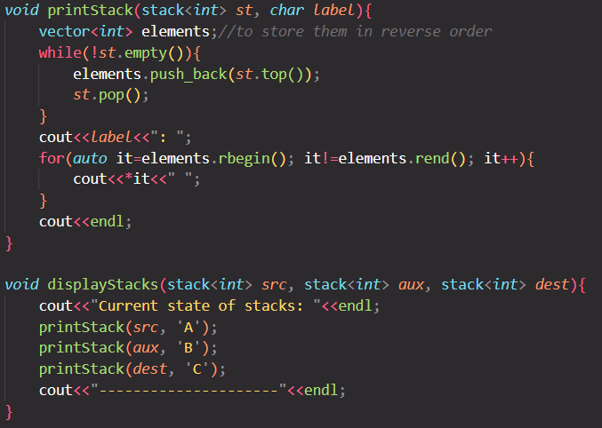

# Tower of Hanoi

This project implements the Tower of Hanoi problem using C++. The Tower of Hanoi is a classic problem in computer science and mathematics, involving three rods and a number of disks of different sizes. The objective is to move all the disks from the source rod to the destination rod, following these rules:
1. Only one disk can be moved at a time.
2. A disk can only be placed on top of a larger disk or on an empty rod.
3. All disks start on the source rod.

## IDE and Git

I used `Visual Studio Code` for writing my code and communicated to my github repository with `Github Desktop`.

## Files

- `Hanoi.cpp`: Contains the implementation of the Tower of Hanoi algorithm.

## How to Run

1. Compile the `Hanoi.cpp` file using a C++ compiler.
2. Run the compiled executable.

## Code Overview

Here is a brief overview of how I implemented the algorithm :

```cpp
void towerOfHanoi(int nmbOfDisks) {
    stack<int> src, aux, dest; // our stacks needed
    char s = 'A', a = 'B', d = 'C';
    int totalMoves = pow(2, nmbOfDisks) - 1;
    for (int i = nmbOfDisks; i >= 1; i--) {
        src.push(i);
    }
    if (nmbOfDisks % 2 == 0) { // if we got an even number of disks
        swap(d, a);
    }
    for (int i = 0; i < totalMoves; i++) {
        if (i % 3 == 0) {
            moveDisk(src, dest, s, d);
        } else if (i % 3 == 1) {
            moveDisk(src, aux, s, a);
        } else if (i % 3 == 2) {
            moveDisk(aux, dest, a, d);
        }
        displayStacks(src, aux, dest);
    }
}
```

## Screenshots

The following screenshot contains how the stacks are displayed in the terminal.


## Acknowledgments

- The Tower of Hanoi problem is a well-known problem in computer science and mathematics.
- This implementation is inspired by various online resources, but mainly was this Youtube video: [https://www.youtube.com/watch?v=S1j5Q03HzMs] .
